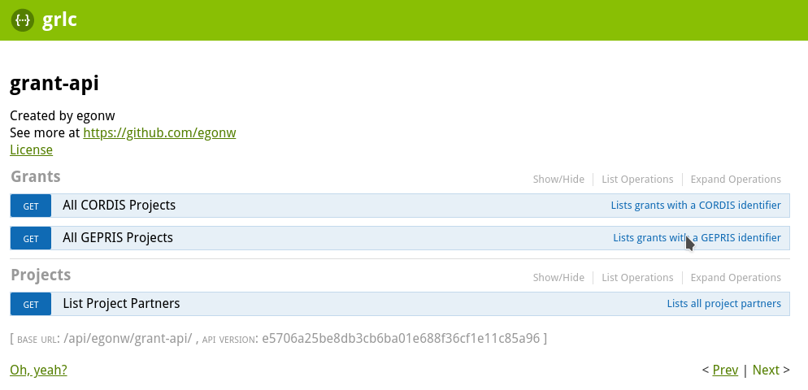

# Wikibase Workshop Grant OpenAPI

The repository make use of the briliant [CLARIAH/grlc](https://github.com/CLARIAH/grlc) Docker image.

Instructions on how to set it up are given in that repository. This is a screenshot of what the SPARQL
queries in this repository look like as OpenAPI:

